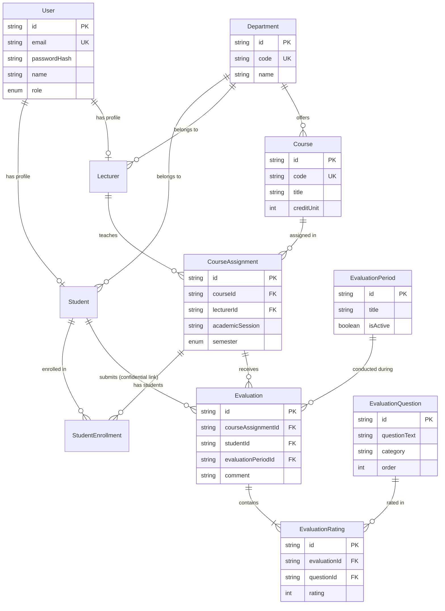

# Database Schema Documentation

## Entity Relationship Diagram (ERD)



---

## Business Integrity Constraints

1. **Unique Evaluation Constraint**:
   ```sql
   ALTER TABLE "evaluations" ADD CONSTRAINT "evaluations_student_course_period_key" 
   UNIQUE ("studentId", "courseAssignmentId", "evaluationPeriodId");
   ```
   Enforces that a student cannot evaluate the same lecturer for the same course twice within an evaluation session.

2. **Cascade & Historical Persistence**:
   - `Evaluation.studentId` is set to `ON DELETE SET NULL`. If a student record is removed, historical evaluation scores remain intact for institution reports.
