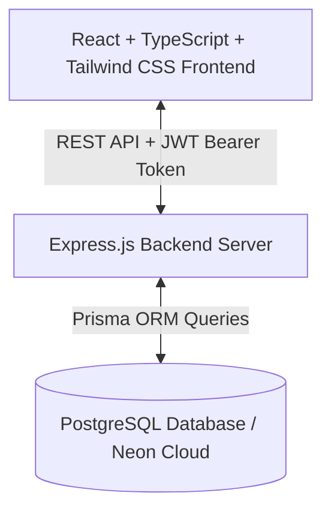

# System Analysis & Design Specification

## Project Title
**Design and Implementation of Student Rating Teachers' Effectiveness System**

---

## 1. System Overview
The **Student Rating Teachers' Effectiveness System (SRTES)** is an academic web application designed to evaluate university teaching staff performance based on structured student evaluations. The system enforces strict business constraints, including **100% student anonymity** for lecturer views and **prevention of duplicate evaluation submissions**.

---

## 2. Functional Requirements

### 2.1 Authentication & Security
- **FR-AUTH-1**: User authentication via email and password using JSON Web Tokens (JWT).
- **FR-AUTH-2**: Password hashing using `bcrypt` (minimum 10 salt rounds).
- **FR-AUTH-3**: Protected route enforcement for Admin, Student, and Lecturer portals.
- **FR-AUTH-4**: User creation restricted strictly to System Administrators.

### 2.2 Administrator Module
- **FR-ADM-1**: Dashboard displaying system metrics (students, lecturers, courses, average ratings).
- **FR-ADM-2**: Full CRUD operations for Students, Lecturers, Departments, and Courses.
- **FR-ADM-3**: Assign academic staff (lecturers) to specific courses for a given term.
- **FR-ADM-4**: Configure the 9 teaching effectiveness criteria questions.
- **FR-ADM-5**: Open and close evaluation periods.
- **FR-ADM-6**: View read-only institution-wide reports and analytics charts.

### 2.3 Student Module
- **FR-STU-1**: View assigned courses and assigned lecturers for active terms.
- **FR-STU-2**: Submit 5-point scale ratings across all 9 teaching effectiveness criteria questions.
- **FR-STU-3**: Submit optional qualitative feedback comments.
- **FR-STU-4**: Enforce single evaluation submission per lecturer per course per evaluation session.
- **FR-STU-5**: View confidential history of submitted evaluations.

### 2.4 Lecturer Module
- **FR-LEC-1**: View overall teaching effectiveness score and rating gauge.
- **FR-LEC-[#]**: View score breakdown per course and per criteria category.
- **FR-LEC-3**: View qualitative student feedback feed with **zero student identification**.
- **FR-LEC-4**: View visual analytics charts of rating distributions.

---

## 3. Non-Functional Requirements

- **NFR-SEC-1 (Anonymity)**: Student identity (`studentId`, user details) must NEVER be exposed via Lecturer API endpoints.
- **NFR-PERF-1 (Response Time)**: API response time under 200ms for evaluation submissions and report fetching.
- **NFR-USE-1 (Usability)**: Responsive, glassmorphic UI accessible on mobile, tablet, and desktop viewports.
- **NFR-MAINT-1 (Maintainability)**: Modular architecture built with TypeScript, Express, Prisma ORM, and React.

---

## 4. User Stories

| ID | User Role | Story Description | Acceptance Criteria |
|:---|:---|:---|:---|
| **US-01** | Student | As a student, I want to rate my lecturer on a 1-5 scale so that the university gets structured feedback. | 9 criteria rated 1-5, progress bar tracks completeness. |
| **US-02** | Student | As a student, I want my feedback to remain anonymous so that my grades are not affected. | Lecturer view displays ratings without student names. |
| **US-03** | Lecturer | As a lecturer, I want to view my overall rating score so that I can improve my teaching methods. | Score gauge and breakdown per course rendered. |
| **US-04** | Admin | As an administrator, I want to open/close evaluation periods so that ratings occur during scheduled windows. | Active period toggle updates system status immediately. |

---

## 5. System Architecture Diagram

